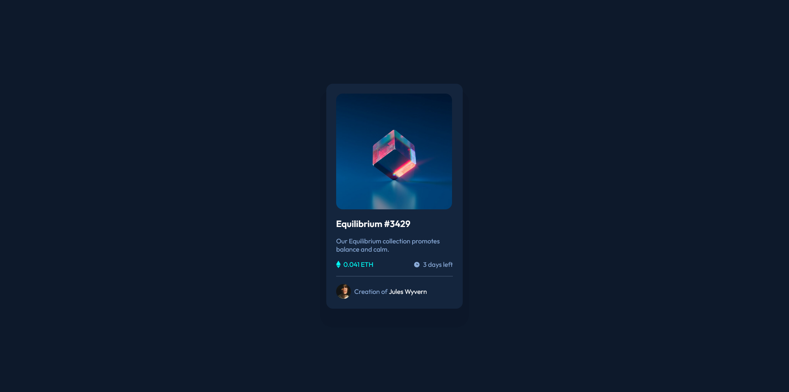

# Frontend Mentor - NFT preview card component solution

This is a solution to the [NFT preview card component challenge on Frontend Mentor](https://www.frontendmentor.io/challenges/nft-preview-card-component-SbdUL_w0U). Frontend Mentor challenges help you improve your coding skills by building realistic projects. 

## Table of contents

- [Overview](#overview)
  - [The challenge](#the-challenge)
  - [Screenshot](#screenshot)
  - [Links](#links)
- [My process](#my-process)
  - [Built with](#built-with)
  - [What I learned](#what-i-learned)
  - [Useful resources](#useful-resources)
- [Author](#author)

## Overview

### The challenge

Users should be able to:

- View the optimal layout depending on their device's screen size
- See hover states for interactive elements

### Screenshot

### Links

- Solution URL: [GitHub](https://github.com/VitorShigueta/nft-preview-card-componenet)
- Live Site URL: [Site](https://splendorous-mandazi-f35b85.netlify.app)

## My process

### Built with

- Semantic HTML5 markup
- CSS custom properties
- Flexbox
- CSS Grid
- Mobile-first workflow

### What I learned

I learned how to use overlay and some variants.

### Useful resources

- [Box shadow generator](https://www.cssmatic.com/box-shadow) - This helped me create shadows easily and quickly.
- [w3schools](https://www.w3schools.com/howto/howto_css_image_overlay.asp) - This helped me understand how to create a overlay with a content.

## Author

- Frontend Mentor - [@VitorShigueta](https://www.frontendmentor.io/profile/VitorShigueta)

# nft-preview-card-componenet
